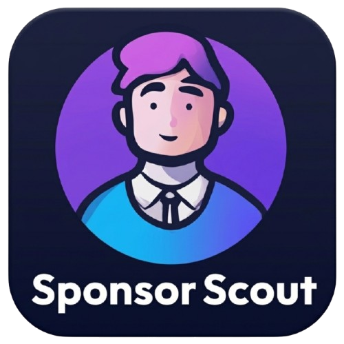

# SponsorScout

[🇬🇧 English](#-english) · [🇮🇹 Italiano](#-italiano)

---

# 🇬🇧 English

## 📖 Table of Contents

- [Download](#-download)
- [What SponsorScout Does](#-what-sponsorscout-does)
- [Quick Start](#-quick-start)
- [The Five Tabs](#-the-five-tabs)
- [Language Switching](#-language-switching)
- [Scan Modes — Full & Custom](#-scan-modes--full--custom)
- [How Scanning Works](#-how-scanning-works)
- [Where Your Data Lives](#-where-your-data-lives)
- [Troubleshooting & FAQ](#-troubleshooting--faq)
- [Building From Source](#-building-from-source)
- [Requirements](#-requirements)
- [License](#-license)

## 📥 Download

Ready-to-use installers are published on the GitHub Releases page:

👉 **[Download the latest release](https://github.com/Kazake95/SponsorScout/releases/tag/SponsorScout_v_0.1.1)**

| Platform | File |
|----------|------|
| Windows 10 / 11 | `sponsorscout-<version>-setup.exe` |
| Linux (Debian / Ubuntu) | `sponsorscout_<version>_amd64.deb` |

> Every release ships both installers as assets on that page — pick the file
> for your platform. Older versions are listed under **Releases**.

---

## ✨ What SponsorScout Does

- **Scans official sources only** — 8 ATS job boards (Ashby, Greenhouse,
  Lever, SmartRecruiters, Personio, Recruitee, Workable, Workday) via their
  public APIs, plus each company's own career page with a headless browser
  when there is no public ATS API.
- **Classifies every job** — EU Blue Card eligibility, relocation / visa
  support and remote-work type are detected from the job description.
- **Keeps everything local** — all data is stored in a SQLite database on your
  own computer. Nothing is uploaded anywhere.
- **Tracks your applications** — a simple pipeline: Saved → Applied →
  Interview → Offer → Rejected.
- **Gives you control** — deduplicate or wipe scanned data, re-verify jobs for
  freshness, and download detailed per-company scan logs.
- **Two languages** — English and Italian, switchable at any time from the
  header dropdown.

---

## 🚀 Quick Start

1. **Download** the installer for your platform from the link above.
2. **Install** it — you don't need Python or anything else; the app and its
   bundled browser come with the installer.
3. **Launch SponsorScout.** On the very first start a welcome box asks whether
   to run an initial scan — click **Yes**. It fetches jobs from every seeded
   company's official job board and career page, and fills the database (takes
   1–3 minutes).
4. Browse the results in the **Search** tab, filter by sponsorship / Blue
   Card / relocation / remote, and start tracking applications from the
   **Applications** tab.

That's it — everything runs locally on your computer.

---

## 🗂 The Five Tabs

### 1. Dashboard
A live overview of your database: total companies, verified jobs, sponsored
jobs, remote jobs and EU Blue Card jobs — plus a "Top companies by
sponsorship" table and a "Jobs by country" table. The **Rescan Companies**
button starts a fresh scan; **Refresh** reloads the numbers.

### 2. Search
The main job browser. Filter by title, company, location, country,
sponsorship, Blue Card, relocation and remote-work type (with a regex search
toggle), then sort by best match or recency. Right-click a row to open it in
your browser or save it to your applications.

### 3. Applications
Your personal application tracker. Select any saved job to set its status
(Saved / Applied / Interview / Offer / Rejected) and add notes.

### 4. Tools
The control centre:
- **Scanner** — **Scan Now** starts the full campaign; **Custom Scan** lets
  you pick specific companies and/or source types (ATS boards and/or career
  pages) instead of every seeded company; **Stop (keep progress)**
  stops it at any time with everything found so far already saved; **Resume**
  continues exactly the remaining companies (even after restarting the app),
  with the progress bar picking up where it stopped. A progress bar under the
  buttons shows live progress (`ATS 12/46`, `Career 88/162`) and reaches 100%
  when the scan finishes; the full per-company output appears in the log
  window. See [Scan Modes](#-scan-modes--full--custom).
- **Scan History** — every past scan run; select one to view or download a
  detailed per-company log including errors. Stopped scans show `cancelled`;
  once a resume finishes everything left, the stopped row becomes `resumed`
  (with a `↩ <child run>` link) and the continuing row shows
  `<status> ↩ resumed from <parent run>`.
- **Data Quality** — remove duplicate jobs/companies, clear expired jobs, or
  wipe all scanned data.
- **Freshness Check** — re-verifies saved jobs against their live pages and
  marks dead listings as expired.

### 5. Data Management
Edit the company lists that SponsorScout scans. Two editors are provided —
**ATS portals** and **Career portals**. You can add, edit or remove
companies; changes are saved to your personal seed files and take effect on
the next scan. A "Reset to bundled defaults" button restores the original
lists.

---

## 🌐 Language Switching

Use the dropdown in the top-right corner of the header to switch between
**English** and **Italiano**. Your choice is remembered and restored on the
next launch.

---

## 🔍 Scan Modes — Full & Custom

### Full scan (the default)

Pressing **Scan Now** (or the Dashboard's **Rescan Companies**) always runs
the complete campaign across every seeded company, because a partial scan
would silently hide jobs you have not asked for. This is the recommended way
to scan.

### What a scan does
- **ATS boards (API)** — every seeded company with a known ATS (Ashby,
  Greenhouse, Lever, SmartRecruiters, Personio, Recruitee, Workable,
  Workday) is pulled through its official job-board API.
- **Career pages (browser)** — every seeded company is also crawled through
  its own career page with a headless browser, so career-page-only companies
  are never skipped.
- **Detail-page enrichment** — each job is then verified against its own job
  page (JSON-LD + page text) to fill in location, sponsorship, relocation
  and EU Blue Card evidence. Nothing is guessed: a verdict is only upgraded
  when the page provides explicit evidence.

> **Why is Full the default?** The old **Quick** option never found *more* or
> *fewer* jobs — it only skipped the detail-page pass, leaving more verdicts
> shown as `?` and some locations blank. For a sponsorship search that is
> the wrong trade-off, so the scan itself always extracts full detail.

### Custom scan (targeted)

**Tools → Custom Scan** opens a picker where you choose exactly what to scan:

- **Source types** — tick *ATS portals* (API-based, fast) and/or *Career
  portals* (crawled with a headless browser, slower). Unticking one simply
  skips that phase.
- **Companies** — each picker lists every company from your seed files (with
  its industry) as a checkbox. Use the filter box to find companies quickly,
  or *Select all* / *Clear* to bulk-toggle.
- A live summary shows how many companies are selected per phase, so you can
  see the scope before starting.

Custom scans run the **same thorough pipeline** as a full scan — the only
difference is *which* targets are scanned, so results are identical in
quality while the run takes time proportional to the selection (e.g. a
10-company career-only scan takes minutes instead of an hour). Use cases:

- re-scan just the companies you added or edited in **Data Management**;
- refresh a handful of interesting companies without waiting a full hour;
- test a new seed row before committing to a full campaign.

Custom runs are labelled `custom` in **Scan History**. **Stop (keep
progress)** and **Resume** work the same way as for a full scan: Resume
continues only the remaining *selected* companies. Your company selection is
not saved between runs — **Scan Now** always covers everything.

---

## 🔧 How Scanning Works

1. SponsorScout reads its **seed files** — curated lists of companies with
   their career URLs and ATS type.
2. Companies with a known ATS are scanned through the official **job-board
   API** (fast).
3. Companies without a public ATS are crawled through their **career page**
   with a headless browser.
4. Every job is classified (Blue Card / relocation / remote) and
   deduplicated.
5. Results are stored in the local SQLite database and appear immediately in
   the Dashboard and Search tabs. The progress bar counts one step per
   finished company (ATS phase first, then career pages), so it always ends
   at 100% — `EMPTY` companies (no open roles right now) count as done too.

Seed files live in your user data folder and can be edited in the Data
Management tab.

---

## 💾 Where Your Data Lives

| Platform | Location |
|----------|----------|
| Windows | `%APPDATA%\SponsorScout` |
| Linux | `~/.sponsorscout` |

Contents: `sponsorscout.db` (all jobs, companies and scan history), `seeds/`
(your editable company lists), `locale.json` (language preference) and the
raw scan-log CSVs under `scan_output/`.

You can override the location with the `SPONSORSCOUT_DATA_DIR` (or
`SPONSORSCOUT_DB_PATH`) environment variable.

---

## 🧰 Troubleshooting & FAQ

**A scan finished but the Dashboard looks empty.**
Click **Refresh** on the Dashboard. If it is still empty, open the Tools tab and
check the latest **Scan History** row: an `error` status, or a **Scan log** with
failures, tells you which companies did not return jobs.

**The log says "Chromium browser is not available".**
JS-rendered career pages are crawled with Playwright Chromium. Both official
installers bundle it; a source checkout needs it once:
`python -m playwright install chromium`.

**Only some companies returned jobs.**
Some companies simply have no open positions right now (`EMPTY` in the log).
Others may temporarily block automated access; running the scan again later
usually fills them in. Nothing is dropped silently - every outcome is recorded
in the scan log.

**The scan is slow, or the PC feels heavy.**
That is the detail-page pass, and it is bounded by design. SponsorScout sizes
its own worker/browser pool from your CPU and RAM (a single browser on a 2-core
/ 8 GB machine), runs at below-normal process priority, and disables images,
GPU and background networking while crawling. The Dashboard stays usable.
**You don't have to sit through it:** press **Stop (keep progress)** any time
— everything found so far is already saved — and press **Resume** later to
continue exactly the remaining companies. Stopping closes all browsers, so
other apps run smoothly again; resuming works even after restarting the app.

**A job shows `?` for Sponsor / Blue Card / Relocation.**
`?` means *unknown*, never *no*. The listing did not contain explicit evidence
either way, so SponsorScout refuses to guess - open the job and judge it
yourself. Jobs are never removed just because a verdict is unknown.

**Can I add my own companies?**
Yes. Open **Data Management** and use the `ATS Portals` / `Career Portals`
editors: add a company name and its careers URL and the ATS type is detected
automatically. Changes apply on the next scan. **Reset to bundled defaults**
brings back the shipped lists.

**How do I search with a regular expression?**
In the **Search** tab tick **Regex**, then type a pattern in the title, company
or location box - for example `(backend|platform).*engineer` matches both
"Backend Engineer" and "Platform Engineer". Matching is case-insensitive, and
an invalid pattern shows a warning and falls back to a normal search instead of
returning nothing.

**Where is my data, and how do I back it up?**
See [Where Your Data Lives](#-where-your-data-lives). Copying
`sponsorscout.db` backs up all jobs, companies and applications.

**Does anything leave my computer?**
No. Everything is stored in a local SQLite database. The only outbound traffic
is fetching the job listings you asked for.

---

## 🏗 Building From Source

Install the build deps first: `pip install -r requirements.txt
-r requirements-dev.txt`.

**Windows (Inno Setup installer):**

```powershell
.\build_exe.ps1
```

Output: `dist\sponsorscout-<version>-setup.exe` (requires Inno Setup 6/7).
The script also bundles the Playwright Chromium browser into the installer.

**Linux (.deb package):**

```bash
./build_deb.sh
```

Output: `dist/sponsorscout_<version>_amd64.deb`.
The script also bundles the Playwright Chromium browser into the .deb.

### 🔎 Developer Checks

Two maintenance scripts in `tools/` guard the things that break silently:

```bash
python tools/check_dev_sync.py               # dev algorithms vs app package
python tools/check_readme_anchors.py --live  # in-page links vs GitHub anchors
```

- `check_dev_sync.py` proves every symbol of the standalone algorithms in
  `extra_for_dev_purpose(do not delete)/main_job_search_algorithms/` is
  implemented in `sponsorscout/`, so a tuned dev script can never be missing
  from the app and make it miss jobs. Use `--strict` in CI.
- `check_readme_anchors.py` recomputes the anchor GitHub generates for every
  heading (a leading emoji becomes part of the anchor, so it is `#-download`
  and must have the same name as its target), so a heading with a stray
  apostrophe or dash cannot leave you with links pointing nowhere. `--live`
  also compares the local result with the anchors GitHub actually published.

---

## 📋 Requirements

- Python 3.10 or newer
- Runtime deps installed via `requirements.txt`: **PySide6**, **requests**,
  **playwright**
- Playwright Chromium (`python -m playwright install chromium`) — used for
  JS-rendered career-page crawling (both installers bundle it already)
- Build/test-only deps in `requirements-dev.txt`: **pyinstaller**, **pytest**

---

## 📄 License

MIT — see [LICENSE](LICENSE).

---

# 🇮🇹 Italiano

## 📖 Indice

- [Scarica](#-scarica)
- [Cosa Fa SponsorScout](#-cosa-fa-sponsorscout)
- [Avvio Rapido](#-avvio-rapido)
- [Le Cinque Schede](#-le-cinque-schede)
- [Cambio Lingua](#-cambio-lingua)
- [Una Sola Modalità di Scansione — Sempre quella Completa](#-una-sola-modalità-di-scansione--sempre-quella-completa)
- [Come Funziona la Scansione](#-come-funziona-la-scansione)
- [Dove Sono i Tuoi Dati](#-dove-sono-i-tuoi-dati)
- [Risoluzione Problemi e Domande Frequenti](#-risoluzione-problemi-e-domande-frequenti)
- [Compilare dai Sorgenti](#-compilare-dai-sorgenti)
- [Requisiti](#-requisiti)
- [Licenza](#-licenza)

## 📥 Scarica

I programmi di installazione pronti all'uso sono pubblicati nella pagina GitHub Releases:

👉 **[Scarica l'ultima versione](https://github.com/Kazake95/SponsorScout/releases/tag/SponsorScout_v_0.1.1)**

| Piattaforma | File |
|-------------|------|
| Windows 10 / 11 | `sponsorscout-<versione>-setup.exe` |
| Linux (Debian / Ubuntu) | `sponsorscout_<versione>_amd64.deb` |

> Ogni versione pubblica entrambi gli installer come file allegati in quella
> pagina — scegli quello per la tua piattaforma. Le versioni precedenti sono
> elencate sotto **Releases**.

---

## ✨ Cosa Fa SponsorScout

- **Scansiona solo fonti ufficiali** — 8 bacheche ATS (Ashby, Greenhouse,
  Lever, SmartRecruiters, Personio, Recruitee, Workable, Workday) tramite le
  loro API pubbliche, più la pagina carriera di ogni azienda con un browser
  headless quando non esiste un'API ATS pubblica.
- **Classifica ogni lavoro** — l'idoneità alla Carta Blu UE, il supporto al
  trasferimento / visto e il tipo di lavoro remoto vengono rilevati dalla
  descrizione del lavoro.
- **Mantiene tutto in locale** — tutti i dati sono salvati in un database
  SQLite sul tuo computer. Nulla viene caricato online.
- **Gestisce le tue candidature** — un semplice percorso: Salvata →
  Inviata → Colloquio → Offerta → Rifiutata.
- **Ti dà il controllo** — deduplica o elimina i dati scansionati, riverifica
  i lavori per l'aggiornamento e scarica i registri dettagliati per azienda.
- **Due lingue** — Italiano e Inglese, selezionabili in qualsiasi momento
  dal menu in alto.

---

## 🚀 Avvio Rapido

1. **Scarica** l'installer per la tua piattaforma dal collegamento qui sopra.
2. **Installa** — non serve Python né altro; l'app e il browser incluso sono
   già nell'installer.
3. **Avvia SponsorScout.** Al primo avvio una finestra chiede se eseguire una
   scansione iniziale — clicca **Sì**. Recupera i lavori da ogni azienda
   nell'elenco, dalla sua bacheca ufficiale e dalla pagina carriera, e
   riempie il database (richiede 1-3 minuti).
4. Sfoglia i risultati nella scheda **Cerca**, filtra per sponsorizzazione /
   Carta Blu / trasferimento / remoto e inizia a gestire le candidature dalla
   scheda **Candidature**.

È tutto — tutto funziona in locale sul tuo computer.

---

## 🗂 Le Cinque Schede

### 1. Pannello (Dashboard)
Una panoramica live del database: aziende totali, lavori verificati, lavori
sponsorizzati, lavori remoti e lavori con Carta Blu UE — più una tabella
"Migliori aziende per sponsorizzazione" e una "Lavori per paese". Il pulsante
**Riscansiona Aziende** avvia una nuova scansione; **Aggiorna** ricarica i
numeri.

### 2. Cerca (Search)
Il browser principale dei lavori. Filtra per posizione, azienda, località,
paese, sponsorizzazione, Carta Blu, trasferimento e tipo di lavoro remoto
(con l'opzione di ricerca tramite regex), poi ordina per corrispondenza
migliore o più recenti. Con il tasto destro su una riga puoi aprirla nel
browser o salvarla nelle candidature.

### 3. Candidature (Applications)
Il tuo registro personale delle candidature. Seleziona un lavoro salvato per
impostarne lo stato (Salvata / Inviata / Colloquio / Offerta / Rifiutata) e
aggiungere note.

### 4. Strumenti (Tools)
Il centro di controllo:
- **Scanner** — **Scansiona Ora** avvia la campagna completa; **Ferma
  (mantieni progresso)** la interrompe in qualsiasi momento mantenendo tutto
  ciò che è stato trovato; **Riprendi** continua esattamente le aziende
  restanti (anche dopo aver riavviato l'app), con la barra di avanzamento che
  riparte da dove si era fermata. Una barra di avanzamento sotto i pulsanti
  mostra il progresso live (`ATS 12/46`, `Carriere 88/162`) e arriva al 100%
  a scansione finita; l'output completo per azienda appare nella finestra di
  log. Non c'è alcuna modalità da scegliere — vedi
  [Una Sola Modalità di Scansione](#-una-sola-modalità-di-scansione--sempre-quella-completa).
- **Cronologia Scansioni** — ogni scansione passata; selezionane una per
  visualizzare o scaricare un registro dettagliato per azienda, errori
  inclusi. Le scansioni interrotte mostrano `cancelled`; quando una ripresa
  completa tutto ciò che restava, la riga interrotta diventa `resumed`
  (con un link `↩ <run figlio>`) e la riga che continua mostra
  `<stato> ↩ resumed from <run genitore>`.
- **Qualità Dati** — rimuovi lavori/aziende duplicati, cancella lavori scaduti
  o elimina tutti i dati scansionati.
- **Verifica Aggiornamento** — riverifica i lavori salvati sulle loro
  pagine live e segna gli annunci non più disponibili come scaduti.

### 5. Gestione Dati (Data Management)
Modifica gli elenchi di aziende che SponsorScout scansiona. Sono forniti due
editor — **Portali ATS** e **Portali Career**. Puoi aggiungere, modificare o
rimuovere aziende; le modifiche vengono salvate nei tuoi file seed personali
e hanno effetto dalla prossima scansione. Il pulsante "Ripristina
predefiniti" ripristina gli elenchi originali.

---

## 🌐 Cambio Lingua

Usa il menu a tendina nell'angolo in alto a destra dell'intestazione per
passare da **Italiano** a **English**. La tua scelta viene salvata e
ripristinata al prossimo avvio.

---

## 🔍 Una Sola Modalità di Scansione — Sempre quella Completa

SponsorScout ha **una sola modalità di scansione**: premendo **Scansiona Ora**
si esegue sempre la campagna completa, perché una scansione parziale
nasconderebbe dei lavori senza alcun avviso.

### Cosa fa una scansione
- **Bacheche ATS (API)** — ogni azienda nell'elenco con un ATS noto (Ashby,
  Greenhouse, Lever, SmartRecruiters, Personio, Recruitee, Workable, Workday)
  viene interrogata tramite l'API ufficiale della sua bacheca lavori.
- **Pagine carriera (browser)** — ogni azienda viene esplorata anche sulla
  propria pagina carriera con un browser headless, quindi le aziende con la
  sola pagina carriera non vengono mai saltate.
- **Arricchimento dalla pagina di dettaglio** — ogni lavoro viene poi
  verificato sulla propria pagina (JSON-LD + testo della pagina) per ricavare
  località, sponsorizzazione, trasferimento e Carta Blu UE. Nulla viene
  ipotizzato: un verdetto viene aggiornato solo se la pagina fornisce
  un'evidenza esplicita.

> **Perché una sola modalità?** La vecchia opzione **Veloce** non trovava né
> *più* né *meno* lavori — saltava solo la fase di dettaglio, lasciando più
> verdetti come `?` e alcune località vuote. Per una ricerca di
> sponsorizzazione è un compromesso sbagliato, quindi l'app non ti chiede più
> di scegliere.

---

---


## 🔧 Come Funziona la Scansione

1. SponsorScout legge i suoi **file seed** — elenchi curati di aziende con
   i loro URL carriera e tipo di ATS.
2. Le aziende con un ATS noto vengono scansionate tramite l'**API ufficiale
   della bacheca** (veloce).
3. Le aziende senza ATS pubblico vengono esplorate attraverso la loro
   **pagina carriera** con un browser headless.
4. Ogni lavoro viene classificato (Carta Blu / trasferimento / remoto) e
   deduplicato.
5. I risultati vengono salvati nel database SQLite locale e appaiono
   immediatamente nelle schede Pannello e Cerca. La barra di avanzamento
   conta un passo per azienda finita (prima la fase ATS, poi le pagine
   carriera), quindi arriva sempre al 100% — anche le aziende `EMPTY`
   (nessuna posizione aperta al momento) contano come completate.

I file seed si trovano nella cartella dati dell'utente e possono essere
modificati nella scheda Gestione Dati.

---

## 💾 Dove Sono i Tuoi Dati

| Piattaforma | Posizione |
|-------------|-----------|
| Windows | `%APPDATA%\SponsorScout` |
| Linux | `~/.sponsorscout` |

Contenuto: `sponsorscout.db` (tutti i lavori, aziende e cronologia delle
scansioni), `seeds/` (i tuoi elenchi di aziende modificabili),
`locale.json` (preferenza lingua) e i CSV di log grezzi in `scan_output/`.

Puoi cambiare la posizione con le variabili d'ambiente `SPONSORSCOUT_DATA_DIR`
(o `SPONSORSCOUT_DB_PATH`).

---

## 🧰 Risoluzione Problemi e Domande Frequenti

**La scansione è finita ma il Pannello sembra vuoto.**
Clicca **Aggiorna** nel Pannello. Se è ancora vuoto, apri la scheda Strumenti e
controlla l'ultima riga in **Cronologia Scansioni**: uno stato `error`, o un
**Registro Scansione** con errori, indica quali aziende non hanno restituito
lavori.

**Nel log compare "Chromium browser is not available".**
Le pagine carriera JS vengono esplorate con Playwright Chromium. Entrambi gli
installer ufficiali lo includono; da codice sorgente serve una volta:
`python -m playwright install chromium`.

**Solo alcune aziende hanno restituito lavori.**
Alcune semplicemente non hanno posizioni aperte in questo momento (`EMPTY` nel
log). Altre possono bloccare temporaneamente l'accesso automatico; rieseguendo
la scansione più tardi di solito si completano. Nulla viene perso in silenzio:
ogni esito è registrato nel log della scansione.

**La scansione è lenta o il PC diventa pesante.**
È la fase di dettaglio, ed è limitata per progettazione. SponsorScout
dimensiona i propri worker/browser in base a CPU e RAM (un solo browser su un PC
con 2 core / 8 GB), gira con priorità di processo inferiore al normale e
disattiva immagini, GPU e rete in background durante l'esplorazione. Il
Pannello resta utilizzabile. **Non devi aspettare tutto il tempo:** premi
**Ferma (mantieni progresso)** quando vuoi — tutto ciò che è stato trovato è
già salvato — e premi **Riprendi** più tardi per continuare esattamente le
aziende restanti. Fermando si chiudono tutti i browser, così le altre app
tornano fluide; la ripresa funziona anche dopo aver riavviato l'app.

**Un lavoro mostra `?` per Sponsor / Carta Blu / Trasferimento.**
`?` significa *sconosciuto*, mai *no*. L'annuncio non conteneva un'evidenza
esplicita, quindi SponsorScout non ipotizza nulla - apri il lavoro e valuta tu.
I lavori non vengono mai rimossi solo perché un verdetto è sconosciuto.

**Posso aggiungere le mie aziende?**
Sì. Apri **Gestione Dati** e usa gli editor `Portali ATS` / `Portali Career`:
inserisci il nome dell'azienda e l'URL carriera, il tipo di ATS viene rilevato
automaticamente. Le modifiche si applicano alla scansione successiva.
**Ripristina predefiniti** riporta gli elenchi forniti.

**Come si cerca con un'espressione regolare?**
Nella scheda **Cerca** spunta **Regex**, poi digita un pattern nel campo
posizione, azienda o località - per esempio `(backend|platform).*engineer`
trova sia "Backend Engineer" sia "Platform Engineer". La ricerca non distingue
maiuscole/minuscole e un pattern non valido mostra un avviso e ripiega su una
ricerca normale invece di restituire zero risultati.

**Dove sono i miei dati e come faccio un backup?**
Vedi [Dove Sono i Tuoi Dati](#-dove-sono-i-tuoi-dati). Copiando
`sponsorscout.db` salvi lavori, aziende e candidature.

**Qualcosa esce dal mio computer?**
No. Tutto è salvato in un database SQLite locale. L'unico traffico in uscita
sono gli annunci lavori che hai chiesto di scaricare.

---

## 🏗 Compilare dai Sorgenti

Installa prima le dipendenze di build: `pip install -r requirements.txt
-r requirements-dev.txt`.

**Windows (installer Inno Setup):**

```powershell
.\build_exe.ps1
```

Output: `dist\sponsorscout-<versione>-setup.exe` (richiede Inno Setup 6/7).
Lo script include anche il browser Playwright Chromium nell'installer.

**Linux (pacchetto .deb):**

```bash
./build_deb.sh
```

Output: `dist/sponsorscout_<versione>_amd64.deb`.
Lo script include anche il browser Playwright Chromium nel pacchetto .deb.

### 🔎 Controlli per Sviluppatori

Due script di manutenzione in `tools/` proteggono ciò che si rompe in
silenzio:

```bash
python tools/check_dev_sync.py               # algoritmi dev vs pacchetto app
python tools/check_readme_anchors.py --live  # link interni vs ancore GitHub
```

- `check_dev_sync.py` dimostra che ogni simbolo degli algoritmi standalone in
  `extra_for_dev_purpose(do not delete)/main_job_search_algorithms/` è
  implementato in `sponsorscout/`, così uno script dev aggiornato non può mai
  mancare nell'app e farle perdere dei lavori. Usa `--strict` in CI.
- `check_readme_anchors.py` ricalcola l'ancora che GitHub genera per ogni
  titolo (un'emoji iniziale entra nell'ancora: è `#-download`, non
  `#download`), così un titolo con apostrofo o trattino non può lasciarti con
  link che non portano da nessuna parte. Con `--live` confronta il risultato
  locale con le ancore realmente pubblicate da GitHub.

---

## 📋 Requisiti

- Python 3.10 o successivo
- Dipendenze di runtime tramite `requirements.txt`: **PySide6**, **requests**,
  **playwright**
- Playwright Chromium (`python -m playwright install chromium`) — usato per
  lo scanning delle pagine carriera JS (entrambi gli installer lo includono
  già)
- Dipendenze solo per build/test in `requirements-dev.txt`: **pyinstaller**,
  **pytest**

---

## 📄 Licenza

MIT — vedi [LICENSE](LICENSE).
